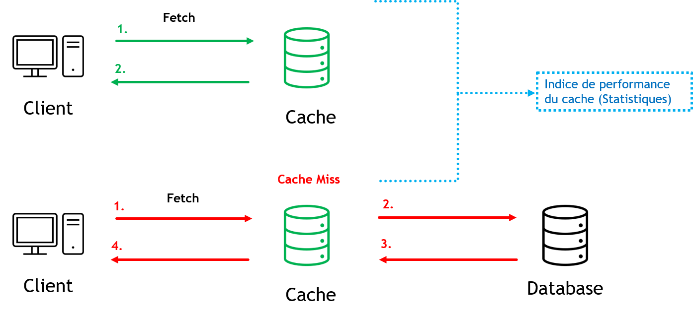
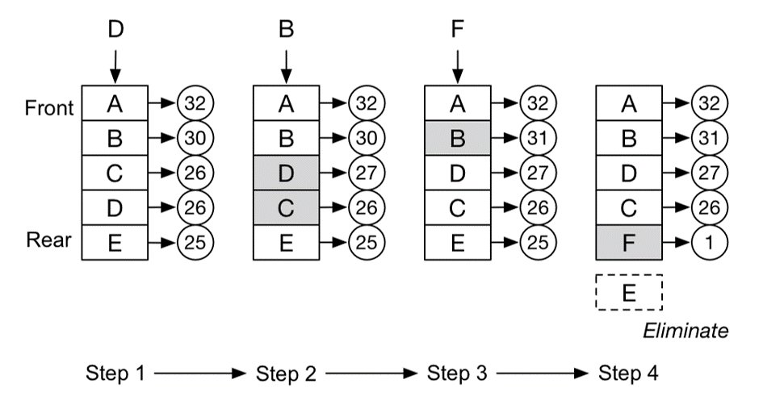
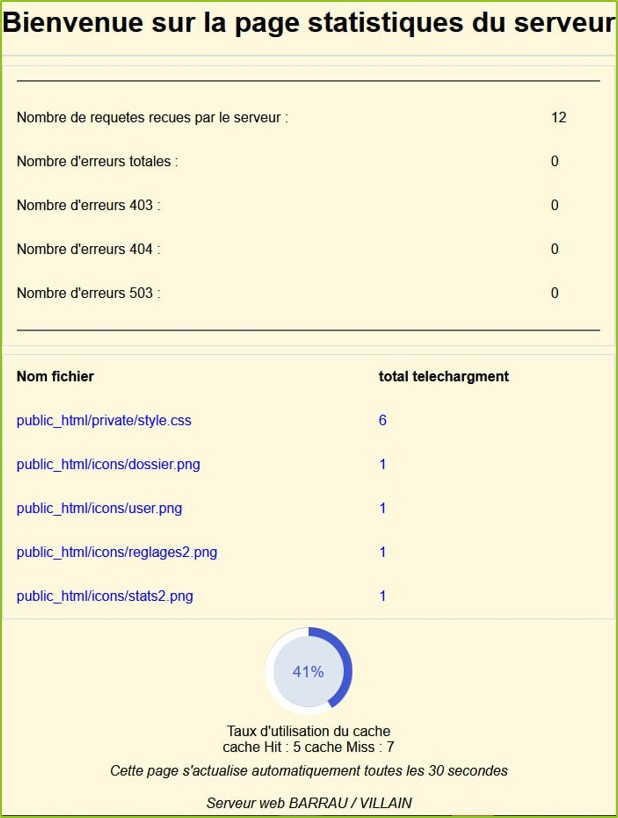
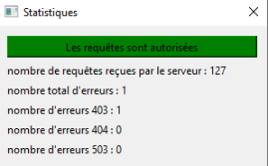

# Serveur web avec cache mémoire
L'objectif de ce projet est de créer un mini serveur web avec cache mémoire.
Ce projet sera basé sur un environnement QT en exploitant l'API socket.

Les fonctionnalités suivantes sont mises en place :

- Traitement des requêtes de lecture de fichier (script y compris)
- Traitement des requêtes de lecture du contenu d'un répertoire
- Traitement des erreurs
- Génération d'une page d'information statistiques
- Gestionnaire de cache des fichiers les plus accédés
- Interface graphique (informations, gestion)

## Sommaire
* [Gestion du cache mémoire](#Gestion-du-cache-mémoire)
* [Section administrateur](#Section-administrateur)
* [Gestion du serveur](#Gestion-du-serveur)
* [Gestion des erreurs](#Gestion-des-erreurs)
* [Statistiques](#Statistiques)
* [Boite de dialogue](#Boite-de-dialogue)
* [Diagramme de classe](#Diagramme-de-classe)
* [Diagramme de séquence](#Diagramme-de-séquence)
* [Pistes d'améliorations](#Pistes-d'améliorations)

## Gestion du cache mémoire
Vue d'ensemble du gestionnaire de cache : 

  

Politique de gestion LFU (Least Frequently Used)
- Cache plein -> retrait de l'élément le moins consulté du cache
- Plusieurs fichiers à fréquentation égale -> retrait du plus ancien

  

## Section administrateur

Génération d'une page de login :
- 1 identifiant administrateur
- Authentification avec cookie (session de 20 min)

  

**Privilèges administrateur :**
- Accès au répertoire *private* (cache_clear, activate, desactivate...)
- Accès à la page statistique
- Requêtes acceptées même quand le serveur est "désactivé"

## Gestion du serveur
Répertoire private -> contient toutes les pages pour gérer le serveur : 
- Accessible uniquement par l'administrateur
- Clear_cache.html : vide le cache serveur
- *Activate/desactivate.html* : active/désactive la réponse aux requêtes clients (autre que l'administrateur)

## Gestion des erreurs

**Pages d'erreur avec/sans redirection :**
- 403 acces forbiden -> redirection vers login
- 404 not found
- 503 service unavailable -> redirection vers login
- Nombre d'erreurs consultable depuis la page statistiques et sur la fenêtre de dialogue

## Statistiques
- Accessible uniquement par l'administrateur
- Informations sur le cache( taux d'éfficacité, cache hit/miss)
- Informations générales : fichiers téléchargés (et combien de fois), nombre de requêtes
- Erreurs survenues : occurences de chaque erreur

  

## Boite de dialogue

- Reprend quelques éléments de la page statistique (Nombre requêtes, erreurs)
- Possibilité d'activer/désactiver la réponse aux requêtes

  

## Diagramme de classe

  

## Diagramme de séquence

  

## Pistes d'améliorations
- Authentification avec token (sécurité renforcée)
- Prendre en compte les modifications de fichiers (fichier périmé dans le cache)
- Création d'une White-list/Black-list pour autoriser/limiter l'accès à certains utilisateurs

